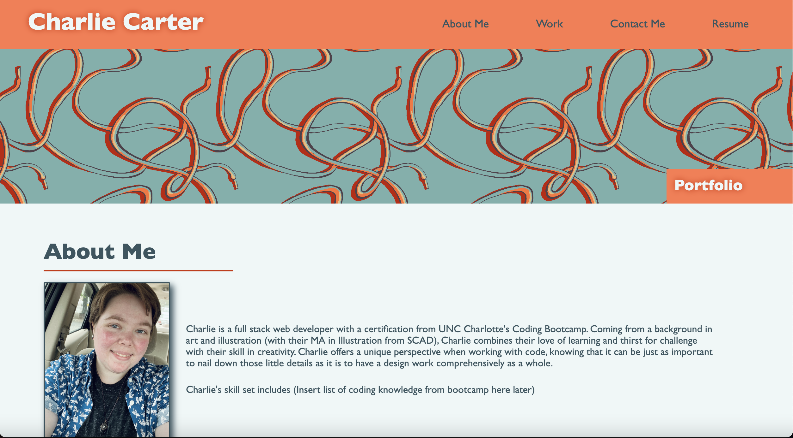
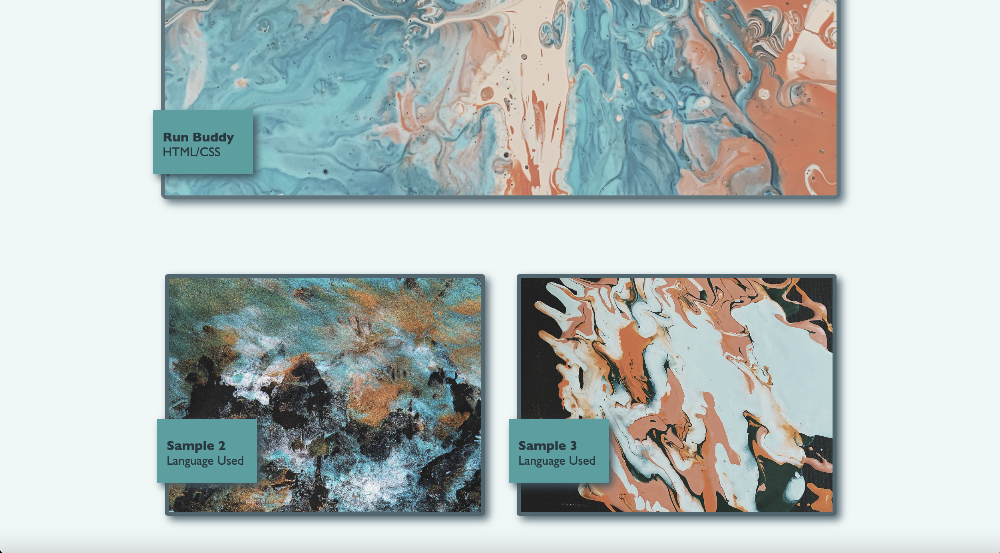
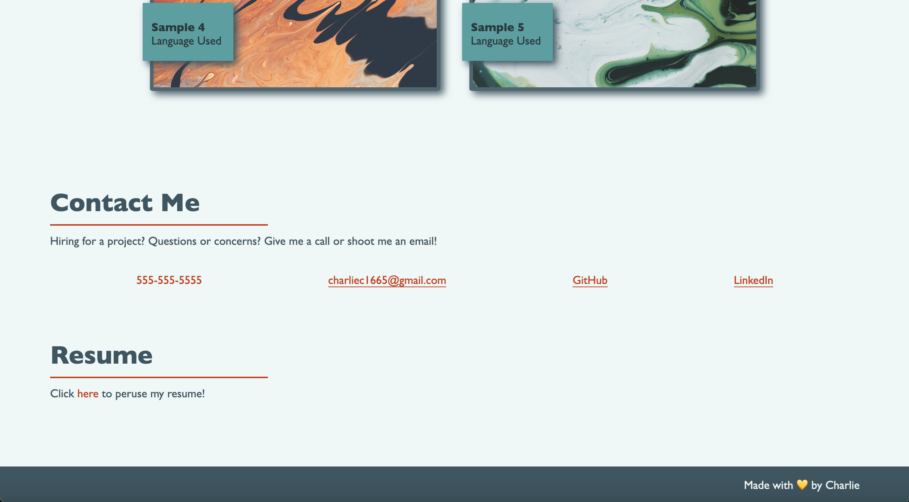

# Charlie's Coding Portfolio

## About

- This portfolio page contains a short bio, a walk-through of my credentials, some work samples, contact information, and my resume.
Everything a future employer might need or want to see.

- The page was created with accessibility in mind, and is responsive to screen size for mobile/tablet users.

## The Final Look

## Credits

Made 100% by me, Charlie. You can see more on my GitHub: 
https://github.com/charliec1665